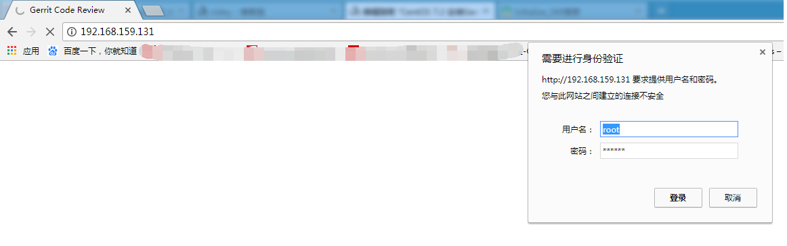
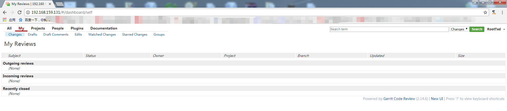
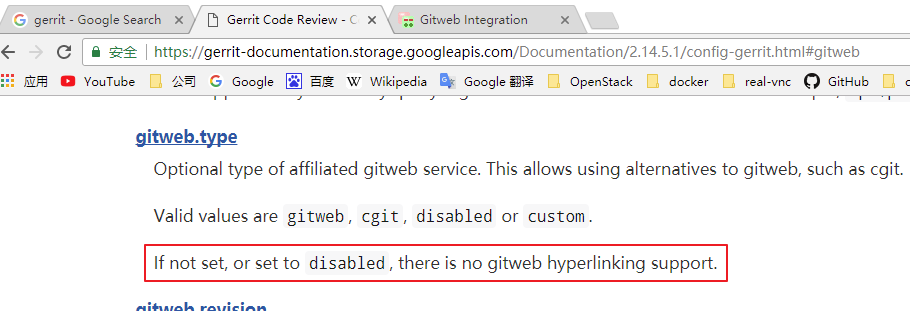
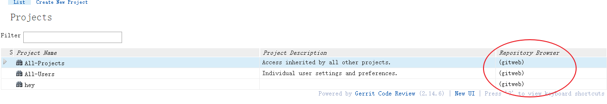
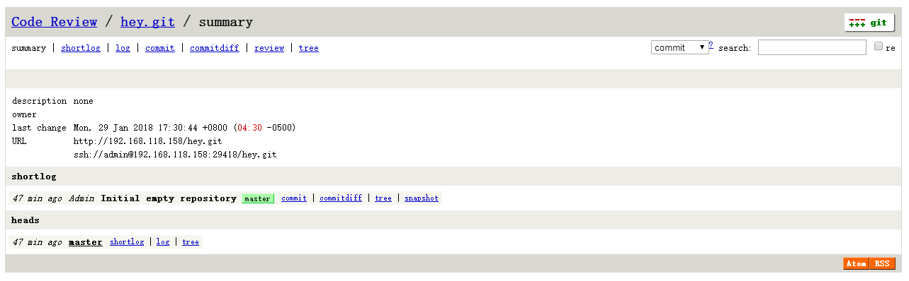

# 1.环境

本文使用VMWare虚拟机进行实验。

- 2核CPU，2GB内存，40GB硬盘，IP：170.106.172.172
- CentOS 8（CentOS Stream 8 64bit 腾讯轻量云服务器）

# 2.需求

[Gerrit](https://www.gerritcodereview.com/)支持多种数据库、多种认证方式（参考[官网手册](https://gerrit-documentation.storage.googleapis.com/Documentation/2.14.6/install.html)），这里使用

- mariadb数据库
- http认证
- Apache http server作为web服务器，提供反向代理
- gitweb作为Repository Browser

# 3.安装

### 3.1 安装软件

```sh
yum -y install git gitweb httpd mariadb-server
```

 

### 3.2 配置数据库

```sh
systemctl start mariadb
mysql
```

键入如下内容，这里密码是123

 ```sql
 CREATE USER 'gerrit'@'localhost' IDENTIFIED BY '123';
 CREATE DATABASE reviewdb DEFAULT CHARACTER SET 'utf8';
 GRANT ALL ON reviewdb.* TO 'gerrit'@'localhost';
 FLUSH PRIVILEGES;
 ```

```sql
这部分 SQL 代码的作用是在 MySQL 数据库中创建一个名为 gerrit 的用户,并创建一个名为 reviewdb 的数据库,同时将对该数据库的所有权限授予给数据库用户 gerrit 。具体分析如下:

CREATE USER 'gerrit'@'localhost' IDENTIFIED BY '123';
创建一个名为 gerrit 的用户,登录主机为 localhost(本地主机),密码为 123。
CREATE DATABASE reviewdb DEFAULT CHARACTER SET 'utf8';
创建一个名为 reviewdb 的数据库,默认字符集为 utf8。
GRANT ALL ON reviewdb.* TO 'gerrit'@'localhost';
将对 reviewdb 数据库的所有权限(ALL PRIVILEGES)授予给 gerrit 用户,该用户只能从本地主机(localhost)登录。
FLUSH PRIVILEGES;
刷新权限,使上述更改生效。
这几步操作的目的是为 Gerrit 代码审查系统创建一个数据库和用户。Gerrit 在运行时需要将一些元数据(如代码评审记录、用户信息等)存储在数据库中,因此需要预先准备好数据库环境。上述代码创建的 reviewdb 数据库就是 Gerrit 默认使用的数据库,而 gerrit 用户则拥有对该数据库的完全控制权限。在 Gerrit 的配置过程中,需要提供这个数据库的连接信息。


```


### 3.3 配置httpd反向代理

```sh
sudo chmod +w /etc/httpd/conf.d/gerrit.conf
sudo vim /etc/httpd/conf.d/gerrit.conf
```

 

键入如下内容

```xml
<VirtualHost *>
    ServerName 170.106.172.172

    ProxyRequests Off
    ProxyVia Off
    ProxyPreserveHost On

    <Proxy *>
          Order deny,allow
          Allow from all
    </Proxy>

    <Location /login/>
      AuthType Basic
      AuthName "Gerrit Code Review"
      AuthBasicProvider file
      AuthUserFile /home/tools/gerrit.passwd
      Require valid-user
    </Location>

    AllowEncodedSlashes On
    ProxyPass / http://127.0.0.1:8081/
</VirtualHost>
```

注意，

- ServerName根据自己实际情况来定， 我用的本机IP
- gerrit的http认证方式，需要使用HTTP基本认证，这里使用文件（**/home/tools/gerrit.passwd，httpd要有访问权限才行**）方式认证。
- 反向代理设置，从根目录"**/**",代理到"**http://127.0.0.1:8081/**"，注意端口8001后面有个斜线。8081是gerrit监听的端口，后面会提到。

 然后恢复文件属性

```sh
sudo chmod -w /etc/httpd/conf.d/gerrit.conf
```


启动httpd，将监听80端口（反向代理到8081端口）

```sh
systemctl start httpd
```

 

### 3.4 添加HTTP认证用户

```sh
touch /home/tools/gerrit.passwd
htpasswd /home/tools/gerrit.passwd "admin"
New password: 123
Re-type new password: 123
Adding password for user admin

chmod -R 777 /home/tools/
```

这里添加了用户admin，密码123（跟Linux本地用户没有关系！）

这样首次访问gerrit时的用户将成为gerrit的管理员，若想再添加用户，需要先在/home/tools/gerrit.passwd中添加，再登录 gerrit 激活, 该新增账号才可以使用。

 

### 3.6 安装gerrit

##### 3.6.1 添加用户

```sh
sudo adduser -m gerrit # -m 添加对应home下目录'
sudo passwd gerrit # 添加账户密码, 我这里 123
sudo chmod +w /etc/sudoers # 给用户添加超级权限, 先添加写的权限
sudo vi /etc/sudoers # 给用户添加超级权限
```

/etc/sudoers 在大约100行, root    ALL=(ALL)       ALL下一行添加

```sh
 90 ## Next comes the main part: which users can run what software on
 91 ## which machines (the sudoers file can be shared between multiple
 92 ## systems).
 93 ## Syntax:
 94 ##
 95 ##      user    MACHINE=COMMANDS
 96 ##
 97 ## The COMMANDS section may have other options added to it.
 98 ##
 99 ## Allow root to run any commands anywhere
 100 root    ALL=(ALL)       ALL
 101 gerrit  ALL=(ALL)       ALL
 102 
 103 ## Allows members of the 'sys' group to run networking, software,
 104 ## service management apps and more.
 105 # %sys ALL = NETWORKING, SOFTWARE, SERVICES, STORAGE, DELEGATING, PROCESSES, LOCATE, DRIVERS
```

```sh
sudo chmod -w /etc/sudoers # 保存后再去除写的权限
```


从[官网](https://gerrit-releases.storage.googleapis.com/gerrit-2.14.6.war)下载gerrit的war包gerrit-xxxx.war，这里放至gerrit的home/tools/目录

##### 3.6.2 创建工作目录

```sh
sudo su - gerrit # - 同时切换环境变量
cd /home/gerrit/tools/
```

##### 3.6.3 安装JRE

从[官网](http://www.oracle.com/technetwork/java/javase/downloads/index.html)下载Java SE Runtime Environment 8u162 Linux x64

jre-8u162-linux-x64.tar

```sh
mkdir jdk # 创建jdk解压目录
tar zxvf jdk-22_linux-x64_bin.tar.gz -C ./jdk # 解压jdk
vim ~/.bash_profile # 添加环境变量
```

~/.bash_profile 文件最后添加内容如下:

 ```sh
 export JAVA_HOME=/home/gerrit/tools/jdk/jdk-22 # 根据自己的java文件名设置目录,我的是jdk-22
 export JRE_HOME=$JAVA_HOME/jre
 export CLASSPATH=$JAVA_HOME/lib
 export PATH=$PATH:$JAVA_HOME/bin:$JRE_HOME/bin:$CLASSPATH
 ```

保存后重载该文件环境变量并验证java

```sh
source ~/.bash_profile
java -version
# 输出如下:
# java version "22" 2024-03-19
# Java(TM) SE Runtime Environment (build 22+36-2370)
# Java HotSpot(TM) 64-Bit Server VM (build 22+36-2370, mixed mode, sharing)
```


##### 3.6.4 安装Gerrit

执行 java -jar 你的gerrit.war init -d gerrit的安装目录, 一路配置都是回车, 具体配置等装完后在配置文件 /home/gerrit/tools/review_site/conf 内统一修改.

```sh
[gerrit@VM-4-7-centos tools]$ java -jar gerrit-3.9.2.war init -d /home/gerrit/tools/review_site
Using secure store: com.google.gerrit.server.securestore.DefaultSecureStore
[2024-04-01 11:44:12,648] [main] INFO  com.google.gerrit.server.config.GerritServerConfigProvider : No /home/gerrit/tools/review_site/etc/gerrit.config; assuming defaults

*** Gerrit Code Review 3.9.2
*** 

Create '/home/gerrit/tools/review_site' [Y/n]? Y

*** Git Repositories
*** 

Location of Git repositories   [git]: 

*** JGit Configuration
*** 

Auto-configured "receive.autogc = false" to disable auto-gc after git-receive-pack.

*** Index
*** 

Type                           [lucene]: 

*** User Authentication
*** 

Authentication method          [openid/?]: 
Enable signed push support     [y/N]? 
Use case insensitive usernames [Y/n]? 

*** Review Labels
*** 

Install Verified label         [y/N]? 

*** Email Delivery
*** 

SMTP server hostname           [localhost]: 
SMTP server port               [(default)]: 
SMTP encryption                [none/?]: 
SMTP username                  : 

*** Container Process
*** 

Run as                         [gerrit]: 
Java runtime                   [/home/gerrit/tools/jdk/jdk-22]: 
Copy gerrit-3.9.2.war to /home/gerrit/tools/review_site/bin/gerrit.war [Y/n]? 
Copying gerrit-3.9.2.war to /home/gerrit/tools/review_site/bin/gerrit.war

*** SSH Daemon
*** 

Listen on address              [*]: 
Listen on port                 [29418]: 
Generating SSH host key ... rsa...

 ed25519... ecdsa 256... ecdsa 384... ecdsa 521... done

*** HTTP Daemon
*** 

Behind reverse proxy           [y/N]? 
Use SSL (https://)             [y/N]? 
Listen on address              [*]: 
Listen on port                 [8080]: 
Canonical URL                  [http://VM-4-7-centos:8080/]: 

*** Cache
*** 


*** Plugins
*** 

Installing plugins.
Install plugin codemirror-editor version v3.9.2 [y/N]? 
Install plugin commit-message-length-validator version v3.9.2 [y/N]? 
Install plugin delete-project version v3.9.2 [y/N]? 
Install plugin download-commands version v3.9.2 [y/N]? 
Install plugin gitiles version v3.9.2 [y/N]? 
Install plugin hooks version v3.9.2 [y/N]? 
Install plugin plugin-manager version v3.9.2 [y/N]? 
Install plugin replication version v3.9.2 [y/N]? 
Install plugin reviewnotes version v3.9.2 [y/N]? 
Install plugin singleusergroup version v3.9.2 [y/N]? 
Install plugin webhooks version v3.9.2 [y/N]? 
Initializing plugins.
No plugins found with init steps.

============================================================================
Welcome to the Gerrit community

Find more information on the homepage: https://www.gerritcodereview.com
Discuss Gerrit on the mailing list: https://groups.google.com/g/repo-discuss
============================================================================
Initialized /home/gerrit/tools/review_site
Init complete, reindexing accounts,changes,groups,projects with: reindex --site-path /home/gerrit/tools/review_site --threads 1 --index accounts --index changes --index groups --index projectsReindexed 0 documents in accounts index in 0.0s (0.0/s)
Index accounts in version 13 is ready
Reindexing groups:      100% (2/2)
Reindexed 2 documents in groups index in 0.3s (6.0/s)
Index groups in version 10 is ready
Reindexing changes: Slicing projects: 100% (2/2), done    
Reindexed 0 documents in changes index in 0.0s (0.0/s)
Index changes in version 84 is ready
Reindexing projects:    100% (2/2)
Reindexed 2 documents in projects index in 0.1s (14.6/s)
Index projects in version 8 is ready
Executing /home/gerrit/tools/review_site/bin/gerrit.sh start
Starting Gerrit Code Review: WARNING: Could not adjust Gerrit's process for the kernel's out-of-memory killer.
         This may be caused by /home/gerrit/tools/review_site/bin/gerrit.sh not being run as root.
         Consider changing the OOM score adjustment manually for Gerrit's PID=845588 with e.g.:
         echo '-1000' | sudo tee /proc/845588/oom_score_adj
OK
Waiting for server on VM-4-7-centos:8080 ... OK
Please open the following URL in the browser: http://VM-4-7-centos:8080/#/admin/projects/[gerrit@VM-4-7-centos tools]$ 
```

完成后查看端口情况,GerritCodeRe 占用 29418 和 8080, httpd占用 80 反向代理作用, mysql占用 3306 提供数据库信息

```sh
[gerrit@VM-4-7-centos tools]$ exit
logout
[root@VM-4-7-centos gerrit]# netstat -tnpl
Active Internet connections (only servers)
Proto Recv-Q Send-Q Local Address           Foreign Address         State       PID/Program name    
tcp        0      0 0.0.0.0:22              0.0.0.0:*               LISTEN      1453/sshd           
tcp        0      0 127.0.0.1:62789         0.0.0.0:*               LISTEN      365992/bin/xray-lin 
tcp6       0      0 :::8080                 :::*                    LISTEN      845588/GerritCodeRe 
tcp6       0      0 :::80                   :::*                    LISTEN      737850/httpd        
tcp6       0      0 :::22                   :::*                    LISTEN      1453/sshd           
tcp6       0      0 :::19802                :::*                    LISTEN      877/x-ui            
tcp6       0      0 :::39802                :::*                    LISTEN      365992/bin/xray-lin 
tcp6       0      0 :::39803                :::*                    LISTEN      365992/bin/xray-lin 
tcp6       0      0 :::29418                :::*                    LISTEN      845588/GerritCodeRe 
tcp6       0      0 :::3306                 :::*                    LISTEN      689222/mysqld       
[root@VM-4-7-centos gerrit]# 
```

修改gerrit的配置文件（/home/gerrit/tools/review_site/etc/gerrit.config）

```
[gerrit]
        basePath = git
        canonicalWebUrl = http://170.106.172.172
        serverId = 2538c5dc-dfb8-483d-9ad4-1d7b86daed23
[container]
        javaOptions = "-Dflogger.backend_factory=com.google.common.flogger.backend.log4j.Log4jBackendFactory#getInstance"
        javaOptions = "-Dflogger.logging_context=com.google.gerrit.server.logging.LoggingContext#getInstance"
        user = gerrit
        javaHome = /home/gerrit/tools/jdk/jdk-22
[index]
        type = lucene
[auth]
        type = HTTP
[receive]
        enableSignedPush = false
[sendemail]
        smtpServer = localhost
[sshd]
        listenAddress = *:29418
[httpd]
        listenUrl = http://127.0.0.1:8081
[cache]
        directory = cache
[database]
        type = mariadb
        hostname = localhost
        database = reviewdb
        username = gerrit
```

```conf
[gerrit]
        basePath = git
        # 指定 Git 仓库的基础路径为 git 目录
        canonicalWebUrl = http://170.106.172.172
        # 设置 Gerrit 服务器的公网 URL 地址
        serverId = 2538c5dc-dfb8-483d-9ad4-1d7b86daed23
        # 设置 Gerrit 服务器的唯一ID

[container]
        javaOptions = "-Dflogger.backend_factory=com.google.common.flogger.backend.log4j.Log4jBackendFactory#getInstance"
        # 设置 Java 日志后端工厂
        javaOptions = "-Dflogger.logging_context=com.google.gerrit.server.logging.LoggingContext#getInstance"
        # 设置 Java 日志上下文
        user = gerrit
        # 运行 Gerrit 进程的系统用户为 gerrit
        javaHome = /home/gerrit/tools/jdk/jdk-22
        # 指定 Java 安装路径

[index]
        type = lucene
        # 使用 Lucene 作为代码索引引擎

[auth]
        type = HTTP
        # 使用 HTTP 身份验证

[receive]
        enableSignedPush = false
        # 禁用签名推送功能

[sendemail]
        smtpServer = localhost
        # 设置发送邮件的 SMTP 服务器为本地主机

[sshd]
        listenAddress = *:29418
        # SSH 守护进程监听所有IP地址的 29418 端口

[httpd]
        listenUrl = http://127.0.0.1:8081/
        # HTTP 服务器监听所有IP地址的 8081 端口

[cache]
        directory = cache
        # 设置缓存目录为 cache

[database]
        type = mariadb
        # 使用 MariaDB 数据库
        hostname = localhost 
        # 数据库主机为本地主机
        database = reviewdb
        # 数据库名为 reviewdb  
        username = gerrit
        # 连接数据库的用户名为 gerrit
```


# 4.测试

使用浏览器访问canonicalWebUrl ，

```
http://192.168.118.145
```

提示输入用户密码，就是/gerrit.password里的http认证用户密码



 

登录成功后，将看到gerrit用户信息登记界面（添Full Name什么的），然后进入主界面



管理命令如下

```
./review_site/bin/gerrit.sh start
./review_site/bin/gerrit.sh stop
./review_site/bin/gerrit.sh status
./review_site/bin/gerrit.sh restart
```

# 5.配置gitweb

参考[官网手册](https://gerrit-documentation.storage.googleapis.com/Documentation/2.14.5.1/config-gitweb.html)，可以使用命令行实现，我这里直接编辑配置文件，

```sh
vi review_site/etc/gerrit.config
```

 

添加如下gitweb配置

```conf
[gitweb]
        cgi = /var/www/git/gitweb.cgi
        type = gitweb
```

 

（**注意！此处有坑！**如果按官网手册用命令配置，type是没有值的，而默认是disabled，不会显示gitweb超链接！必须手动设置！）



 

 

 重启gerrit，退出web窗口，重新认证登录，可以看见gitweb超链接了

```sh
review_site/etc/bin/gerrit.sh restart
```




浏览hey项目，



 

# 6.配置邮箱验证

如果按前面默认配置，使用本机smtp发送邮件，这样如果发到公网邮箱（qq、163等），会被判定为垃圾邮件，发不出去。

如果是实验性质的话，可以在局域网搭建postfix+dovecot+dnsmasq简单邮件系统，进行邮箱注册。

（gerrit的账号必须注册邮箱，添加ssh公钥/http密码，git 配置邮箱必须跟注册邮箱一致，才能push）

 

我再看看其他解决垃圾邮件方法...

# 7.设置开机自启服务

将 /home/gerrit/tools/review_site/bin/gerrit.service 内容更改:

```service
# Systemd unit file for gerrit
[Unit]
Description=Gerrit Code Review
After=syslog.target network.target
[Service]
Type=simple
# user为启动该服务的用户权限
user=gerrit
WorkingDirectory=/home/gerrit/tools/review_site/
ExecStart=/home/gerrit/tools/jdk-22/bin/java -Xmx1024m -jar /home/gerrit/tools/review_site/bin/gerrit.war daemon -d /home/gerrit/tools/review_site
SyslogIdentifier=GerritCodeReview
#StandardInput=socket 这个参数要去掉, 不然systemctl start的时候报错, 说start参数非法,根本原因我也不知道, 去掉也能用
[Install]
WantedBy=multi-user.
```

然后复制到/etc/systemd/system/下

```sh
sudo cp /home/gerrit/tools/review_site/bin/gerrit.service /etc/systemd/system/
chmod -x /etc/systemd/system/gerrit.service
```

设置开机自启并启动

```sh
systemctl enable gerrit.service
systemctl start gerrit.service
```


# 8.代码推送操作流

## 8.1 创造项目

在gerrit web ui -> BROWSE->Repositories->右上角 CREATE NEW

创建项目 test001.git

## 8.2 ssh密钥配置

### 8.2.1 ssh密钥对生成

```sh
ssh-keygen -t rsa
```

默认生成到 C:\Users\xuzho\.ssh, 默认使用的也是这, 最好不要改路径

## 8.3 ssh测试链接

```sh
ssh -p 29418 admin@170.106.172.172
 ****    Welcome to Gerrit Code Review    ****

  Hi admin, you have successfully connected over SSH.

  Unfortunately, interactive shells are disabled.
  To clone a hosted Git repository, use:

  git clone ssh://admin@43.128.62.125:29418/REPOSITORY_NAME.git

Connection to 43.128.62.125 closed.

```


## 8.4 ssh clone项目

git clone ssh://admin@170.106.172.172:29418/test001.git

## 8.5 hook下载

从 https://gerrit-review.googlesource.com/tools/hooks/commit-msg 下载 commit-msg

```sh
curl -Lo .git/hooks/commit-msg https://gerrit-review.googlesource.com/tools/hooks/commit-msg
```

**上述命令几率失败, 也可以直接浏览器下载,反正能下载就行, 这里附上commit-msg 可直接使用.**

 [commit-msg](CentOs搭建Gerrit.assets\commit-msg) 

然后放在当前工程 git/hooks 下并赋予可执行权限

```sh
chmod +x ./git/hooks/commit-msg
```

然后在push时 推到 Code Review 分支即可

```sh
git push --porcelain --progress origin refs/heads/master:refs/for/master
```

以下是推送CodeReview的官网说明

```sh
Push for Code Review
  $ git commit
  $ git push origin HEAD:refs/for/master

  // this is the same as:
  $ git commit
  $ git push origin HEAD:refs/for/refs/heads/master
Push with bypassing Code Review
  $ git commit
  $ git push origin HEAD:master

  // this is the same as:
  $ git commit
  $ git push origin HEAD:refs/heads/master
```

# 9. 仓库权限操作流