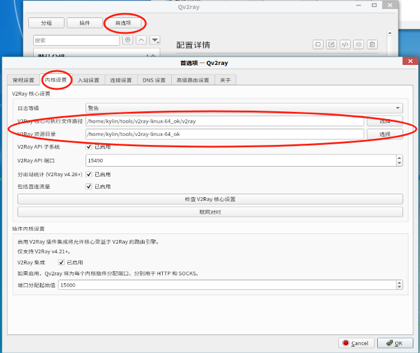
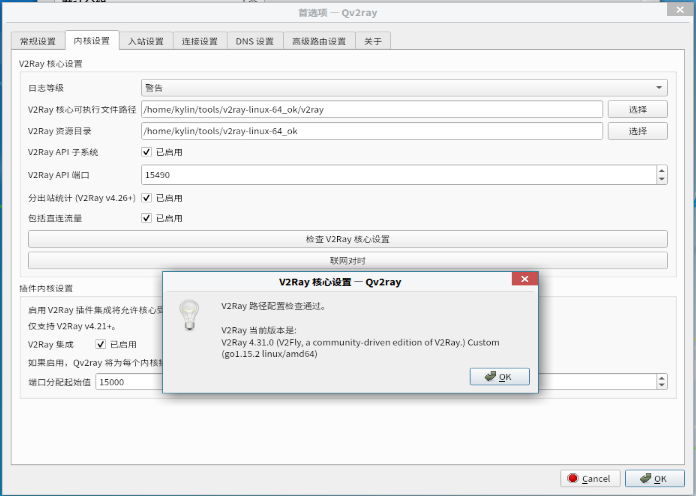

# 介绍

重新安装了个linux虚拟机系统, 因为在下载源的时候有些源只有国外链接才有, 所以需要搭个系统代理.

# 前提准备

1. **v2ray界面**

   这里我下载了Qv2ray作为界面控制. 

   网址: https://github.com/Qv2ray/Qv2ray/releases/download/v2.7.0/Qv2ray-v2.7.0-linux-x64.AppImage

2. **v2ray核心**

   这里我下载了v2ray核心, 为了界面调用v2ray接口必须要核心.

   网址: https://github.com/v2fly/v2ray-core/releases/download/v4.31.0/v2ray-linux-64.zip

# 操作流程

## 开机自启的准备工作

1. 将 **Qv2ray-v2.7.0-linux-x64.AppImage** 赋予执行权限并且编写脚本使其开机启动

   ```sh
   sudo chmod +x ./Qv2ray-v2.7.0-linux-x64.AppImage
   sudo mv ./Qv2ray-v2.7.0-linux-x64.AppImage /usr/bin/Qv2ray
   sudo vim /etc/init.d/Qv2rayTask.sh
   ```

2. **Qv2rayTask.sh** 内容如下:

   ```sh
   #!/bin/bash
   
   /usr/bin/Qv2ray &
   ```

3. 赋予脚本执行权限, 然后执行程序准备进行配置

   ```sh
   sudo chmod +x /etc/init.d/Qv2rayTask.sh
   Qv2ray &
   ```

## 核心配置和添加节点

 1. 核心配置

    解压 **v2ray-linux-64.zip** 然后设置以下两个: 参数和目录

    

点击验证有版本号即可



2. 添加节点

   自己找免费节点或者自己买节点去添加.