# VSCODE 使用 Remote SSH 连接虚拟机并创建工作区

## 1. 确保虚拟机有 ssh 服务

```sh
zx@zx-virtual-machine:~$ service sshd status
● ssh.service - OpenBSD Secure Shell server
     Loaded: loaded (/lib/systemd/system/ssh.service; enabled; vendor preset: enabled)
     Active: active (running) since Wed 2023-12-13 10:50:57 CST; 6min ago
       Docs: man:sshd(8)
             man:sshd_config(5)
   Main PID: 4005 (sshd)
      Tasks: 1 (limit: 4559)
     Memory: 4.1M
        CPU: 138ms
     CGroup: /system.slice/ssh.service
             └─4005 "sshd: /usr/sbin/sshd -D [listener] 0 of 10-100 startups"

12月 13 10:50:57 zx-virtual-machine systemd[1]: Starting OpenBSD Secure Shell server...
12月 13 10:50:57 zx-virtual-machine sshd[4005]: Server listening on 0.0.0.0 port 22.
12月 13 10:50:57 zx-virtual-machine sshd[4005]: Server listening on :: port 22.
12月 13 10:50:57 zx-virtual-machine systemd[1]: Started OpenBSD Secure Shell server.
12月 13 10:51:10 zx-virtual-machine sshd[4286]: Accepted password for zx from 127.0.0.1 port 57056 ssh2
12月 13 10:51:10 zx-virtual-machine sshd[4286]: pam_unix(sshd:session): session opened for user zx(uid=1000) by (uid=0)
12月 13 10:55:15 zx-virtual-machine sshd[4953]: Accepted password for zx from 192.168.20.222 port 50572 ssh2
12月 13 10:55:15 zx-virtual-machine sshd[4953]: pam_unix(sshd:session): session opened for user zx(uid=1000) by (uid=0)
```

若没有则需要安装

```sh
sudo apt-get update
sudo apt install net-tools
sudo apt install ssh
```

然后再用 service ssh status 查看是否开启 sshd 服务

## 2. windows 使用 cmd 测试 ssh 是否可以登录

在虚拟机内查看ip

```sh
zx@zx-virtual-machine:~$ ifconfig
ens33: flags=4163<UP,BROADCAST,RUNNING,MULTICAST>  mtu 1500
        inet 192.168.20.111  netmask 255.255.254.0  broadcast 192.168.21.255
        inet6 fe80::4d65:cf03:e39c:be7d  prefixlen 64  scopeid 0x20<link>
        ether 00:0c:29:72:f8:da  txqueuelen 1000  (Ethernet)
        RX packets 28087  bytes 5343722 (5.3 MB)
        RX errors 0  dropped 0  overruns 0  frame 0
        TX packets 1618  bytes 294239 (294.2 KB)
        TX errors 0  dropped 0 overruns 0  carrier 0  collisions 0

lo: flags=73<UP,LOOPBACK,RUNNING>  mtu 65536
        inet 127.0.0.1  netmask 255.0.0.0
        inet6 ::1  prefixlen 128  scopeid 0x10<host>
        loop  txqueuelen 1000  (Local Loopback)
        RX packets 373  bytes 38519 (38.5 KB)
        RX errors 0  dropped 0  overruns 0  frame 0
        TX packets 373  bytes 38519 (38.5 KB)
        TX errors 0  dropped 0 overruns 0  carrier 0  collisions 0

zx@zx-virtual-machine:~$
```

可以看到 ip 为 192.168.20.111

在windwos 使用cmd 测试ssh登录

```bat
ssh zx@192.168.20.111 -p 22
```

然后输入密码登录

```cmd
C:\Users\xuzho>ssh zx@192.168.20.111 -p 22
zx@192.168.20.111's password:
Welcome to Ubuntu 22.04.1 LTS (GNU/Linux 6.2.0-39-generic x86_64)

 * Documentation:  https://help.ubuntu.com
 * Management:     https://landscape.canonical.com
 * Support:        https://ubuntu.com/advantage

447 updates can be applied immediately.
283 of these updates are standard security updates.
To see these additional updates run: apt list --upgradable

Last login: Wed Dec 13 10:55:15 2023 from 192.168.20.222
zx@zx-virtual-machine:~$
```

可以登录即可

## 3. VSCODE 安装 Remote SSH

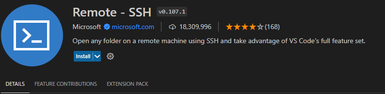

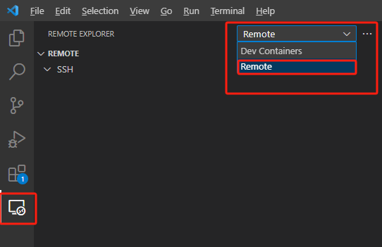

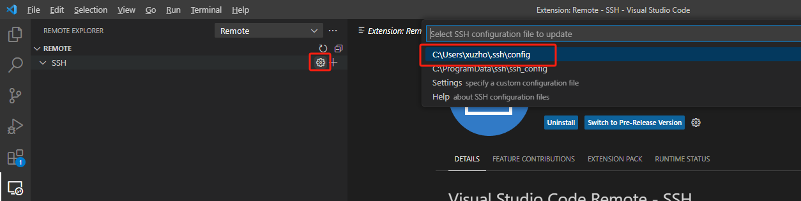

设置好 IP ,用户名 和端口

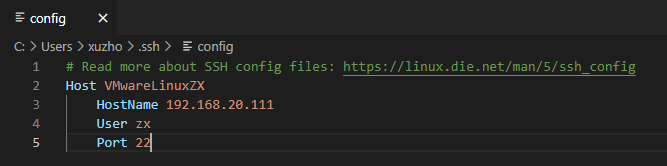

Ctrl + s 保存后点击刷新就能看到连接配置选项了

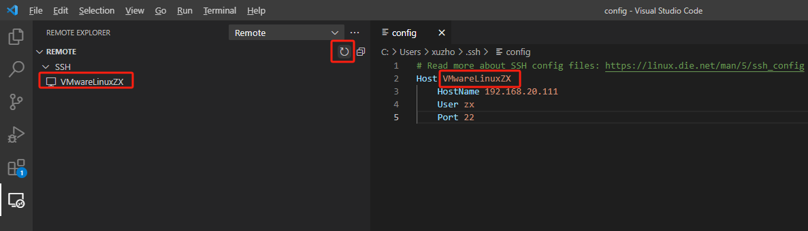

在当前页面连接 ssh 

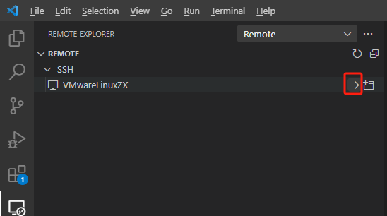

第一次会让选择系统平台,他会给你写道 Remote SSH 的配置文件中, 后续就不用再选了

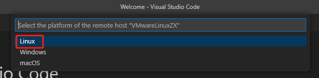

然后输入密码

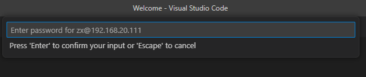

会在目标远程机上用目标的网络下载一些东西, 没有国外网络的玩家就可能下载失败. 我这里有环境所以直接下载成功了...

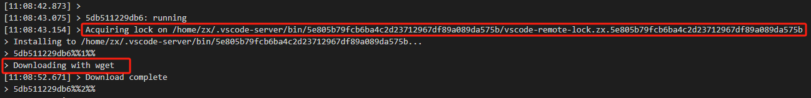

查了网上的解决办法是在vscode远程下载时(也就是日志跑到这里的时候)马上去目标远程虚拟机上用命令查看下载的链接, 复制链接到可以下载的环境去手动下载, 再拷贝到远程虚拟机中, 然后修改vscode的下载脚本 entension.js 中的这个下载步骤 为 拷贝下载包到当前目录即可.

示例操作如下: 

解决方法：
step 1: 当报错wget download failed时，到远程目标机器上看下下载链接

```sh
ps -ef|grep wget

root     29373 29372  0 02:16 ?        00:00:00 wget --tries=1 --connect-timeout=7 --dns-timeout=7 -nv -O vscode-server-linux-x64.tar.gz https://update.code.visualstudio.com/commit:26076a4de974ead31f97692a0d32f90d735645c0/server-linux-x64/stable
```

找一台可以科学上网的机器手工下载
```sh
wget  -O vscode-server-linux-x64.tar.gz https://update.code.visualstudio.com/commit:26076a4de974ead31f97692a0d32f90d735645c0/server-linux-x64/stable
```

step 2: 将手工下载的文件上传到远程目标机器上，我这里放在根目录暂存
```sh
cp vscode-server-linux-x64.tar.gz /vscode-server-linux-x64.tar.gz
```

step 3: 修改本地机器上的脚本文件 C:\Users\administrator\.vscode-insiders\extensions\ms-vscode-remote.remote-ssh-0.35.0\out\extension.js
搜索 "wget ${function(e){return e?"--tries=1":""}(!!d)} --connect-timeout=7 --dns-timeout=7 -nv -O vscode-server-linux-$VSCODE_ARCH.tar.gz https://update.code.visualstudio.com/commit:$COMMIT_ID/server-linux-$VSCODE_ARCH${u?"-web":""}/${r}" （双引号以内内容）
替换为 "cp /vscode-server-linux-x64.tar.gz ."（双引号以内内容）

retry，跳过下载环节

至此, 可以在terminal看到已经登录成功了

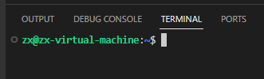

然后就是建立工作区, 这个就简单了,直接就可以看到远程虚拟机上面的文件结构

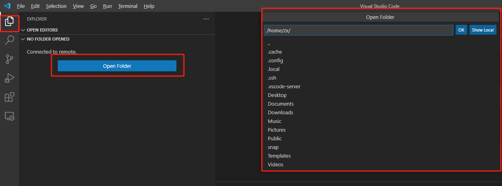