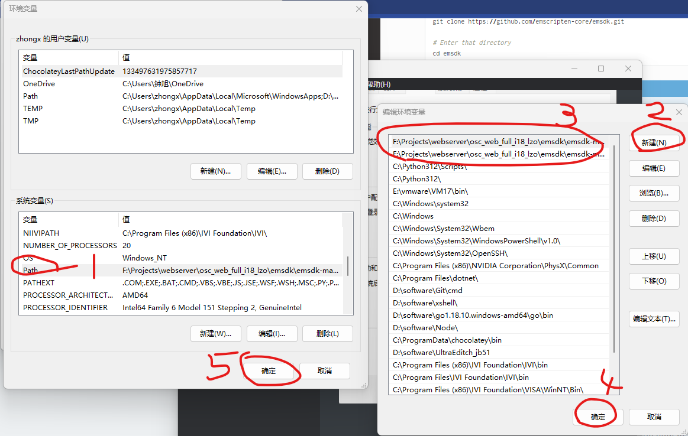
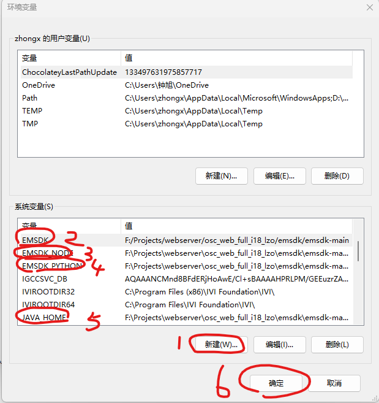

# EMSDK 安装和配置

## 一. EMSDK安装

https://emscripten.org/docs/getting_started/downloads.html

## 二. 安装注意事项

### windows:

安装主要步骤

```sh
# Download and install the latest SDK tools.
./emsdk.bat install latest

# Make the "latest" SDK "active" for the current user. (writes .emscripten file)
./emsdk.bat activate latest

# Activate PATH and other environment variables in the current terminal
emsdk_env.bat
```

在第三步 执行 emsdk_env.bat时, 可能由于权限问题导致环境变量无法正常添加设置, 所以以下是手动设置的方式:

windows键->编辑系统环境变量->环境变量




在PATH添加两个环境变量, 根据自己安装目录填写

我的是

```txt
F:\Projects\webserver\osc_web_full_i18_lzo\emsdk\emsdk-main
F:\Projects\webserver\osc_web_full_i18_lzo\emsdk\emsdk-main\upstream\emscripten
```



再添加四个环境变量: EMSDK EMSDK_NODE EMSDK_PYTHON JAVA_HOME

我的是

```txt
EMSDK = F:/Projects/webserver/osc_web_full_i18_lzo/emsdk/emsdk-main
EMSDK_NODE = F:\Projects\webserver\osc_web_full_i18_lzo\emsdk\emsdk-main\node\16.20.0_64bit\bin\node.exe
EMSDK_PYTHON = F:\Projects\webserver\osc_web_full_i18_lzo\emsdk\emsdk-main\python\3.9.2-nuget_64bit\python.exe
JAVA_HOME = F:\Projects\webserver\osc_web_full_i18_lzo\emsdk\emsdk-main\java\8.152_64bit
```

修改emsdk默认配置, 以防找不到 /usr/bin 和/usr/local

默认配置路径, 我的是 

```txt
F:\Projects\webserver\osc_web_full_i18_lzo\emsdk\emsdk-main\upstream\emscripten\.emscripten
```

将以下内容更改为对应emsdk的目录,还有node执行程序位置

我的是

```txt
LLVM_ROOT = 'F:\\Projects\\webserver\\osc_web_full_i18_lzo\\emsdk\\emsdk-main\\upstream\\bin' # directory
BINARYEN_ROOT = 'F:\\Projects\\webserver\\osc_web_full_i18_lzo\\emsdk\\emsdk-main\\upstream' # directory

NODE_JS = 'D:\\software\\nvm\\NODEJS\\node.EXE' # executable
```

然后重新打开命令行(git-bash或者powershell等), 输入emcc -v 可以看到正常信息,无报错即可使用.

```sh
zhongx@zx MINGW32 /f/Projects/webserver/osc_web_full_i18_lzo/emsdk/emsdk-main/upstream/emscripten
$ emcc -v
emcc (Emscripten gcc/clang-like replacement + linker emulating GNU ld) 3.1.54 (a95c44ee924d02fa1498f846595485d27c31daa8)
clang version 19.0.0git (https://github.com/llvm/llvm-project e769fb8699e3fa8e40623764f7713bfc783b0330)
Target: wasm32-unknown-emscripten
Thread model: posix
InstalledDir: F:\Projects\webserver\osc_web_full_i18_lzo\emsdk\emsdk-main\upstream\bin

```

