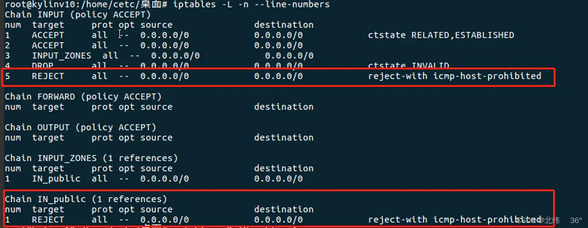

最近在使用龙芯3A4000的国产电脑，预装的是国产操作系统银河麒麟V10，遇到了不能ping通的问题，能上网，也能ping通别的电脑，大概率是防火墙的问题，由于我对防火墙不太熟悉，折腾了两个小时，总算可以正常使用ssh了，特此记录一下：

系统上默认的安装的是iptables，使用 

```sh
iptables -L -n --line-numbers
```

 查看ip和端口号的设置，如下图所示：



上图中方框内的规则就是对ping命令的显示，删除这两条规则：

```sh
iptables -D IN_public 1
iptables -D INPUT 5
```

删除之后，其他电脑就可以ping通银河麒麟V10了，ssh也可以使用了，so easy！貌似大功告成了，可是.............................**重启**以后，依然ping不通，所以，还需要将修改后的规则保存一下，保存到某个地方，系统启动时调用，具体流程如下：

1、保存iptables当前配置

```sh
sudo iptables-save > /etc/iptables
```

我是直接在/etc/路径下面保存了一个叫iptables的文件

2、在/etc/rc.local里面增加规则重载脚本

```sh
iptables-restore < /etc/iptables
```

到此为止，就可以优雅的在银河麒麟V10系统上使用ssh了，再也不用害怕重启了！